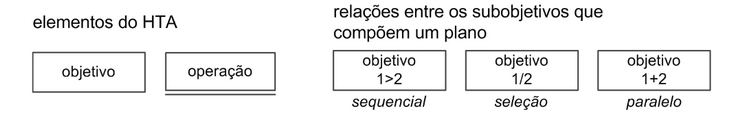
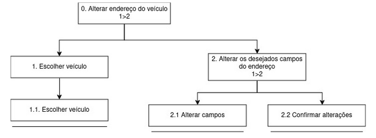
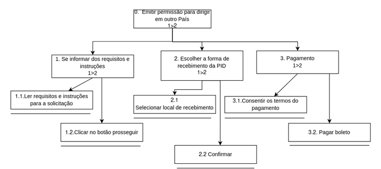

#Análise Hierárquica de Tarefas#

##Introdução Análise Hierárquica de tarefas##

A Análise Hierárquica de Tarefas (AHT) é uma ferramenta valiosa para descrever, organizar e compreender as atividades dos usuários em um sistema, ajudando os designers a desenvolver soluções que atendam melhor às necessidades e expectativas dos usuários.

Ela se baseia na hierarquia de atividades e é organizada em objetivos, subobjetivos e operações. Um plano determina a ordem em que essas atividades serão executadas.

Um diagrama da análise de tarefas segue uma padronização gráfica própria, mostrada na figura 1.

*Fonte: Interação  Humano Computador - BARBOSA, Simone; DINIZ, Bruno. 2010*
  

### Alterar endereço do veículo ###

Tarefa em que o usuário precisa realizar a alteração do endereço em que seu veículo está cadastrado.

*Fonte: Interação  Humano Computador - BARBOSA, Simone; DINIZ, Bruno. 2010*
  

| Objetivos / Operações                | Descrição                                                                      |
|--------------------------------------|--------------------------------------------------------------------------------|
| **0. Alterar endereço do veículo**  | - **Input:** Dados do endereço alterados   - **Feedback:** Usuário visualiza prompt de mensagem de sucesso da operação   - **Plano:** Alterar dados pré-existentes e depois confirmar alterações   - **Recomendação:** Permitir que o usuário efetue a alteração de endereço online |
| **1. Escolher veículo**             | - **Plano:** Escolher de qual veículo deseja alterar o endereço                |
| **1.1 Escolher veículo**                                        |                                                  |
| **2. Alterar os desejados campos do endereço** | - **Plano:** Alterar um ou mais dos seguintes campos: CEP, logradouro, número, complemento, município, UF, bairro    |
| **2.1 Alterar campos**                                        |                                                     |
| **2.2 Confirmar alterações**                                        |                                                     |

### Solicitar Permissão Internacional para Dirigir (PID) ###

Tarefa em que o usuário solicita uma Permissão Internacional para Dirigir.

*Fonte: Interação  Humano Computador - BARBOSA, Simone; DINIZ, Bruno. 2010*
  

| Objetivos / Operações                        | Problemas e Recomendações                                                                   |
|----------------------------------------------|----------------------------------------------------------------------------------------------|
| **0. Emitir permissão para dirigir em outro País** | - **Input:** Escolha de endereço e pagamento   - **Feedback:** Apenas o boleto e nada mais   - **Plano:** Solicitar PID   - **Recomendação:** Permitir que o usuário efetue a alteração de endereço online |
| **1. Se informar dos requisitos e instruções**      | - **Plano:** Se informar dos requerimentos e instruções para solicitar a PID                      |
|        **1.1 Ler requisitos e instruções para a solicitação**                                         |                                          |
| **1.2 Clicar no botão prosseguir**                                                                     |                                         |
| **2. Escolher a forma de recebimento da PID**       | - **Plano:** Escolher se a PID será buscada no Detran ou enviada por encomenda                  |
|**2.1 Selecionar local de recebimento**                                          |                                     |
|**2.2 Confirmar** |                                                                               |
| **3. Pagamento**                                    | - **Plano:** Consentir os termos do pagamento e pagar                                             |
|        **3.1 Consentir os termos do pagamento**|                                                       |
|**3.2 Pagar**                                                  |                                                                                   ||

## 📑 Histórico de versão

|   Versão   | Data  | Descrição            | Autor                                                  | Revisor |
| :--------: | :---: | :------------------- | ------------------------------------------------------ | ------- |
| 06/05/2024 |  1.0  | AHT 1 e 2| [Pedro Sena](https://github.com/pedroyen21) | [Filipe Carvalho](https://github.com/Filipe-002)     |
