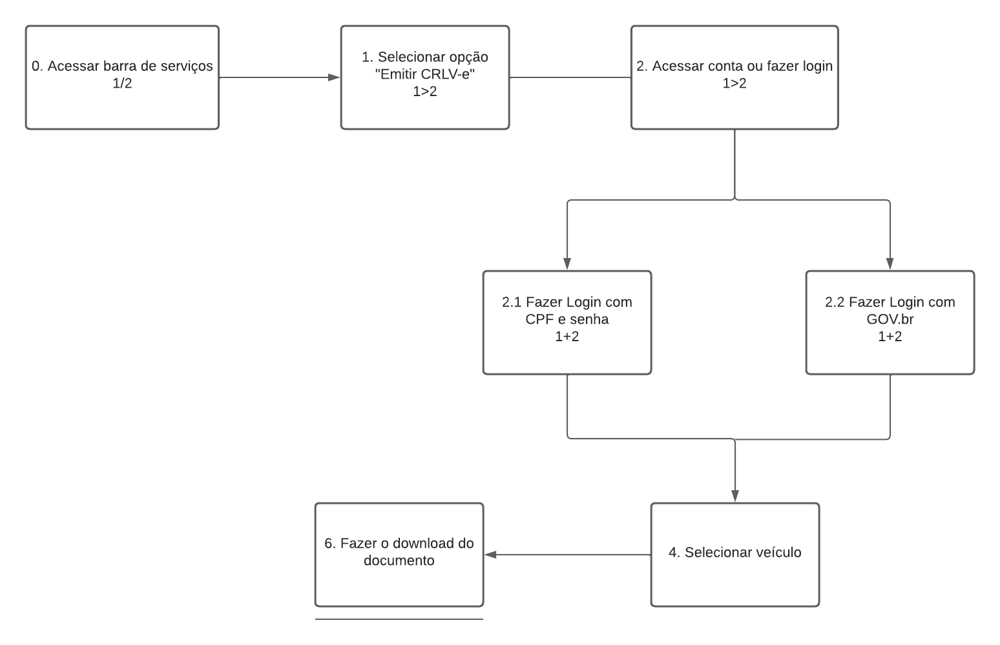
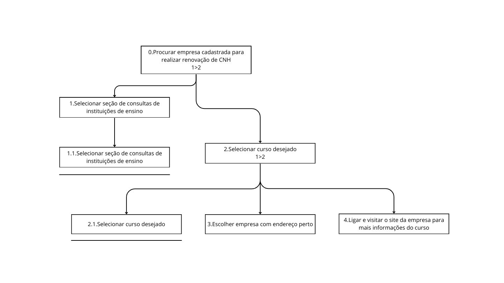

# Análise Hierárquica de Tarefas#

## Introdução Análise Hierárquica de tarefas##

A Análise Hierárquica de Tarefas (AHT) é uma ferramenta valiosa para descrever, organizar e compreender as atividades dos usuários em um sistema, ajudando os designers a desenvolver soluções que atendam melhor às necessidades e expectativas dos usuários.

Ela se baseia na hierarquia de atividades e é organizada em objetivos, subobjetivos e operações. Um plano determina a ordem em que essas atividades serão executadas.

Um diagrama da análise de tarefas segue uma padronização gráfica própria, mostrada na figura 1.

*Fonte: Interação  Humano Computador - BARBOSA, Simone; DINIZ, Bruno. 2010*
  

### Alterar endereço do veículo ###

Tarefa em que o usuário precisa realizar a alteração do endereço em que seu veículo está cadastrado.

*Fonte: Interação  Humano Computador - BARBOSA, Simone; DINIZ, Bruno. 2010*
  

| Objetivos / Operações                          | Descrição                                                                                                                                                                                                                                                                                    |
| ---------------------------------------------- | -------------------------------------------------------------------------------------------------------------------------------------------------------------------------------------------------------------------------------------------------------------------------------------------- |
| **0. Alterar endereço do veículo**             | - **Input:** Dados do endereço alterados   - **Feedback:** Usuário visualiza prompt de mensagem de sucesso da operação   - **Plano:** Alterar dados pré-existentes e depois confirmar alterações   - **Recomendação:** Permitir que o usuário efetue a alteração de endereço online |
| **1. Escolher veículo**                        | - **Plano:** Escolher de qual veículo deseja alterar o endereço                                                                                                                                                                                                                              |
| **1.1 Escolher veículo**                       |                                                                                                                                                                                                                                                                                              |
| **2. Alterar os desejados campos do endereço** | - **Plano:** Alterar um ou mais dos seguintes campos: CEP, logradouro, número, complemento, município, UF, bairro                                                                                                                                                                         |
| **2.1 Alterar campos**                         |                                                                                                                                                                                                                                                                                              |
| **2.2 Confirmar alterações**                   |                                                                                                                                                                                                                                                                                              |

### Solicitar Permissão Internacional para Dirigir (PID) ###

Tarefa em que o usuário solicita uma Permissão Internacional para Dirigir.

*Fonte: Interação  Humano Computador - BARBOSA, Simone; DINIZ, Bruno. 2010*
  

| Objetivos / Operações                                  | Problemas e Recomendações                                                                                                                                                                                           |
| ------------------------------------------------------ | ------------------------------------------------------------------------------------------------------------------------------------------------------------------------------------------------------------------- |
| **0. Emitir permissão para dirigir em outro País**     | - **Input:** Escolha de endereço e pagamento   - **Feedback:** Apenas o boleto e nada mais   - **Plano:** Solicitar PID   - **Recomendação:** Permitir que o usuário efetue a alteração de endereço online |
| **1. Se informar dos requisitos e instruções**         | - **Plano:** Se informar dos requerimentos e instruções para solicitar a PID                                                                                                                                        |
| **1.1 Ler requisitos e instruções para a solicitação** |                                                                                                                                                                                                                     |
| **1.2 Clicar no botão prosseguir**                     |                                                                                                                                                                                                                     |
| **2. Escolher a forma de recebimento da PID**          | - **Plano:** Escolher se a PID será buscada no Detran ou enviada por encomenda                                                                                                                                      |
| **2.1 Selecionar local de recebimento**                |                                                                                                                                                                                                                     |
| **2.2 Confirmar**                                      |                                                                                                                                                                                                                     |
| **3. Pagamento**                                       | - **Plano:** Consentir os termos do pagamento e pagar                                                                                                                                                               |
| **3.1 Consentir os termos do pagamento**               |                                                                                                                                                                                                                     |
| **3.2 Pagar**                                          |                                                                                                                                                                                                                     |  |

### Emissão de Nada Consta da CNH ###

Operação onde o usuário solicita um documento que comprove que não há pendências em sua CNH.

*Fonte: Interação  Humano Computador - BARBOSA, Simone; DINIZ, Bruno. 2010*
  

| Objetivos / Operações                                     | Problemas e Recomendações                                                                                                                                                                                                                                                                                                      |
| --------------------------------------------------------- | ------------------------------------------------------------------------------------------------------------------------------------------------------------------------------------------------------------------------------------------------------------------------------------------------------------------------------ |
| **0. Emissão de Nada Consta da CNH**                      | - **Input:** Acesso ao site do DETRAN-DF e login realizado   - **Feedback:** Documento "Nada Consta" exibido na tela   - **Plano:** Navegar pelo site, realizar login, selecionar a funcionalidade e emitir o documento   - **Recomendação:** Garantir que todas as etapas de verificação e segurança sejam cumpridas |
| **1. Acesso ao website**                                  | - **Plano:** Acessar diretamente o site do DETRAN-DF                                                                                                                                                                                                                                                                           |
| **1.1 Acessar site do DETRAN-DF**                         |                                                                                                                                                                                                                                                                                                                                |
| **2. Página de Login**                                    | - **Plano:** Navegar até a página de login                                                                                                                                                                                                                                                                                     |
| **2.1 Navegar até a página de login**                     |                                                                                                                                                                                                                                                                                                                                |
| **3. Login**                                              | - **Plano:** Inserir credenciais e efetuar login                                                                                                                                                                                                                                                                               |
| **3.1 Inserir credenciais**                               |                                                                                                                                                                                                                                                                                                                                |
| **3.2 Efetuar login**                                     |                                                                                                                                                                                                                                                                                                                                |
| **4. Seleção da Funcionalidade**                          | - **Plano:** Navegar no menu até a opção desejada                                                                                                                                                                                                                                                                              |
| **4.1 Passar o mouse sobre a opção "CNH"**                |                                                                                                                                                                                                                                                                                                                                |
| **4.2 Selecionar "Consultar CNH"**                        |                                                                                                                                                                                                                                                                                                                                |
| **5. Visualização de Informações**                        | - **Plano:** Verificar as informações da CNH                                                                                                                                                                                                                                                                                   |
| **5.1 Visualizar resumo das informações da CNH**          |                                                                                                                                                                                                                                                                                                                                |
| **6. Captcha**                                            | - **Plano:** Completar verificação de segurança                                                                                                                                                                                                                                                                                |
| **6.1 Completar verificação "Não sou um robô"**           |                                                                                                                                                                                                                                                                                                                                |
| **7. Emissão de Documento**                               | - **Plano:** Solicitar a emissão do documento "Nada Consta"                                                                                                                                                                                                                                                                    |
| **7.1 Clicar no botão "Emitir nada consta"**              |                                                                                                                                                                                                                                                                                                                                |
| **7.2 Visualizar ícone de carregamento**                  |                                                                                                                                                                                                                                                                                                                                |
| **8. Visualização e Ações com o Documento**               | - **Plano:** Visualizar o documento e optar por imprimi-lo ou enviá-lo por e-mail                                                                                                                                                                                                                                              |
| **8.1 Página atualiza e exibe o documento "Nada Consta"** |

### Emitir CRLV ###

Tarefa em que o usuário faz a emissão da CRLV (Certificado de registro e licenciamento de veículo).

 *Fonte: Interação  Humano Computador - BARBOSA, Simone; DINIZ, Bruno. 2010*

  

| Objetivos / Operações                       | Problemas e Recomendações                                                                                                                    |
| ------------------------------------------- | -------------------------------------------------------------------------------------------------------------------------------------------- |
| **0.Acessar barra de serviços 1>2**         | - **Feedback:** Apresentar todos os serviços existentes   - **Plano:** Solicitar CRLV                                                  |
| **1. Selecionar opção "Emitir CRLV-e 1>2"** |                                                                                                                                              |
| **2. Acessar conta ou fazer login 1>2**     |                                                                                                                                              |
| **2.1. Fazer login com CPF e  senha 1+2**   | - **Input:** Inserir CPF cadastrado e senha -   **Plano:** Se os dados estiverem corretos, informa ao servidor que está tudo ok           |
| **2.2. Fazer login com GOV.br**             | - **Input:** Inserir CPF cadastrado e senha no GOV.bt   - **Plano:** Se os dados estiverem corretos, informa ao servidor que está tudo ok |
| **3. Selecionar veículo**                   |                                                                                                                                              |
| **4. Fazer o download do documento**        |                                                                                                                                              |

### Procurar empresa cadastrada para realizar renovação de CNH 

Tarefa em que o usuário busca por uma empresa cadastrada no Detran - DF para renovação de sua Carteira Nacional de Habilitação.

*Fonte: Interação  Humano Computador - BARBOSA, Simone; DINIZ, Bruno. 2010*
  

| **Objetivos / Operações**                                          | **Problemas e Recomendações**                                                                                                                                                                                            |
|--------------------------------------------------------------------|--------------------------------------------------------------------------------------------------------------------------------------------------------------------------------------------------------------------------|
| 0.Procurar empresa cadastrada para realizar renovação de CNH       | - Input: Escolha de tipo de curso e empresa
- Feedback: Lista de empresas e dados da empresa escolhida
- Plano: Buscar empresa para renovação de CNH
- Recomendação: Permitir uma busca em todas as empresas cadastradas |
| 1.Selecionar seção de consultas de instituições de ensino          | - Plano: Selecionar seção de instituições de ensino                                                                                                                                                                      |
| 1.1.Selecionar seção de consultas de instituições de ensino        |                                                                                                                                                                                                                          |
| 2.Selecionar curso desejado                                        | - Plano: Selecionar curso de Renovação de CNH                                                                                                                                                                            |
| 2.1.Selecionar curso desejado                                      |                                                                                                                                                                                                                          |
| 3.Escolher empresa com endereço perto                              | - Plano: Escolher empresa para entender sobre o curso                                                                                                                                                                    |
| 4.Ligar e visitar o site da empresa para mais informações do curso | - Plano: Ligar para empresa selecionada                                                                                                                                                                                  |

## 📑 Histórico de versão

|    Data    | Versão | Descrição                                      | Autor                                                  | Revisor                                                |
| :--------: | :----: | :--------------------------------------------- | ------------------------------------------------------ | ------------------------------------------------------ |
| 06/05/2024 |  1.0   | AHT 1 e 2                                      | [Pedro Sena](https://github.com/pedroyen21)            | [Filipe Carvalho](https://github.com/Filipe-002)       |
| 20/05/2024 |  1.1   | AHT 3                                          | [Vinicius Vieira](https://github.com/viniciusvieira00) | [Filipe Carvalho](https://github.com/Filipe-002)       |
| 22/05/2024 |  1.2   | Inclusão do AHT de CRLV e correção de detalhes | [Filipe Carvalho](https://github.com/Filipe-002)       | [Vinicius Vieira](https://github.com/viniciusvieira00) |
| 22/05/2024 |  1.3  | AHT de Consultar Empresas | [Pedro Miguel](https://github.com/pedroMADBR) | [Filipe Carvalho](https://github.com/Filipe-002)     |

