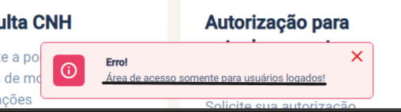
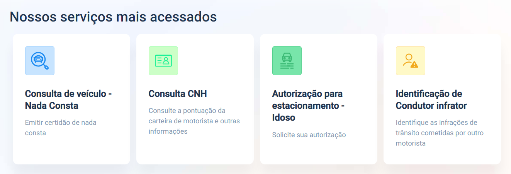
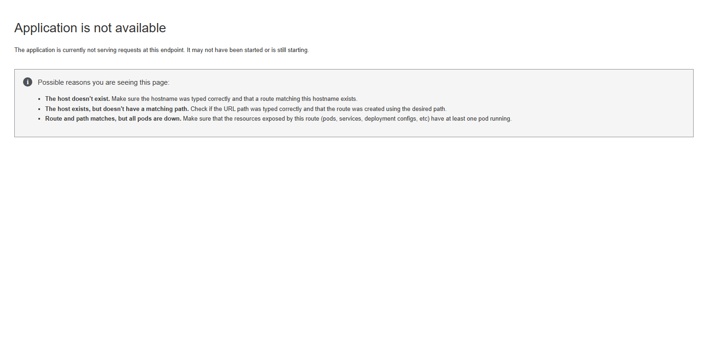

## Introdução

Para seguirmos com a melhor execução do projeto e definição dos conceitos de IHC, Norman (1998) destaca a necessidade de utilizarmos um modelo conceitual em que "deve auxiliar a interpretar o relacionamento entre as ações e informações apresentadas pelo sistema e o conhecimento no mundo" (BARBOSA, 2010, pág. 265). Com o intuito de elaborar a melhor versão possível desse modelo, utilizamos uma série de **princípios e diretrizes**, sendo os mais conhecidos e utilizados os de Norman (1988), de Tognazzini (2003), de Nielsen (1993) e as regras de ouro de Shneiderman (1998).

Esses princípios giram em torno dos seguintes tópicos: 

- correspondência com as expectativas dos usuários; 
- simplicidade nas estruturas das tarefas; 
- equilíbrio entre controle e liberdade do usuário; 
- consistência e padronização; 
- promoção da eficiência do usuário; 
- antecipação das necessidades do usuário; 
- visibilidade e reconhecimento; 
- conteúdo relevante e expressão adequada;
- projeto para erros.

## Metodologia

Para verificarmos a aplicação desses princípios no portal do Detran-DF, utilizamos o método de Definição e Violação. Em Definição, será explicado o que é o princípio e como ele se aplica, e em Violação, mostraremos como esse princípio e quebrado no site.

## Correspondência com as expectativas do usuário

### Definição

Refere-se à ideia de que os sistemas devem ser projetados de modo a alinhar-se com as concepções e preconcepções que os usuários têm sobre como as coisas devem funcionar. Em outras palavras, os designs devem ser intuitivos e familiares, facilitando a interação e minimizando a necessidade de aprendizado por parte dos usuários. Por exemplo, em um comércio eletrônico, é fundamental adaptar a interface e a funcionalidade do site para atender às necessidades e preferências dos clientes, visando proporcionar uma experiência de compra intuitiva, conveniente e eficiente, assim como seria a experiência em um comércio local.

### Violação

Na Figura 1, que mostra a página inicial do Portal Detran-DF, é mostrado os serviços oferecidos pelo site, o que correspondem a o que seria caso fosse realizado um atendimento presencial. 

Figura 1: Página inicial do Portal Detran-DF

O problema é que, ao digitar Detran-DF em um serviço de pesquisa, como mostrado na Figura 2, não é levado diretamente ao Portal Detran Digital, que é onde é feito os serviços.

Figura 2: Resultado do site de pesquisa

É levado ao site da Figura 3, que seria um web-site com informações que podem não ser relevantes ou pouco tem a ver com os serviços, como consulta de multas, renovação de CNH, entre outros.

Figura 3: Site do Detran-DF

Isso mostra uma violação do princípio da Correspondência com as expectativas do usuário, pois além de não levar à página desejada, não se é claro onde se encontram determinadas informações/serviços.

### Sugestão de melhoria

Uma boa solução para esse problema, seria que, ao invés de ter duas páginas, Detran-DF e Portal Detran-DF, poderíamos unir as duas páginas em uma só, facilitando o acesso do usuário aos serviços e ao digitar "Detran DF" em algum serviço de pesquisa.

## Simplicidade nas estruturas das tarefas

### Definição

O princípio de Simplicidade nas estruturas das tarefas, segundo Norman, refere-se à ideia de que as atividades e interações dos usuários com um sistema devem ser simples e diretas, sem exigir esforços cognitivos excessivos. Isso implica em projetar sistemas que minimizem a complexidade das tarefas, tornando a interação mais intuitiva e eficiente.

### Violação

Esse princípio será violado por um problema que será constante na análise. De antemão, não é informado explicitamente ao usuário quais serviços estão disponíveis com ou sem um cadastro, conforme visto na Figura 1, mostrando o site inicial. Somente na página de login é mostrado que **alguns** serviços possuem livre acesso, conforme a Figura 4:

Figura 4: Aviso

### Sugestão de melhoria

Na página inicial do Portal, seria interessante se houvesse algum aviso, como o mostrado na Figura 04, de forma clara para que o usuário entenda que para se aproveitar 100% do site, é necessário fazer login no serviço.

## Equilíbrio entre controle e liberdade do usuário

### Definição
Nessa parte, é destacado que o sistema deve oferecer uma certa liberdade para o usuário, afinal, o próprio não pode se sentir demasiadamente automatizado em relação à realização das tarefas, tanto como dar liberdade demais do usuário pode acabar fazendo-o se perder ao utilizar o sistema.

### Violação

Por conta de ser exigido um login para o total acesso ao site, muitas funções não são liberadas, porém são mostradas livremente ao usuário, gerando uma certa confusão sobre o que se pode fazer com ou sem login, conforme mostrado abaixo:

Figura 1: Página inicial do Portal Detran-DF

### Sugestão de melhoria

Uma solução seria apresentar uma tela com o seguinte título: "Serviços para todos os usuários", logo abaixo teria uma sessão com as funcionalidades disponíveis. Em seguida, uma sessão dizendo: "Para acesso dessas funcionalidade, por favor, clique aqui para fazer login:" e viria um pop-up com a tela de login.

## Consistência e padronização

### Definição

Norman e Tognazzini afirmam que para facilitar o aprendizado e uso de um sistema, é recomendado assegurar a consistência da interface com o modelo conceitual embutido no sistema. Em resumo, tudo deveria seguir o mesmo padrão ao longo do site.

### Violação

No caso do Detran, o site em si é bem padronizado, havendo basicamente duas telas diferentes para o usuário: a tela principal, e a tela quando é clicado em algum serviço, conforme mostrado na Figura 5:

Figura 5: Página de serviços

A violação ocorre na outra página de login, onde é encaminhado para a página do Gov.br, onde é um layout completamente diferente, conforme a Figura 6:

Figura 6: Página de login Gov.br

### Sugestão de melhoria

Ao invés de gerar uma tela em outra aba para login, o que pode gerar erros, poderia ser aberto um pop-up no próprio site solicitando as informações necessárias para continuar.

## Promoção da eficiência do usuário

### Definição

Tognazzini recomenda que sempre seja considerada a eficiência do usuário, e não a do computador, ou seja, o sistema deve ser rápido, manter o usuário sempre ocupado, sensível a o que o usuário está fazendo, proteger o trabalho dele, se manter informado, fornecer atalhos e aceleradores.

### Violação

O Portal Detran-DF falha, de certa forma, em alguns desses aspectos. O sistema é sim rápido e mantem o usuário ocupado, mas não é sensível a o que o usuário está fazendo, falhando diversas vezes em sua página de login, consequentemente não protegendo o trabalho, e não são fornecidos atalhos e aceleradores evidentes, como por exemplo, não encaminhando para a página de login quando o usuário tenta acessar um serviço que só está disponível com um cadastro, conforme indicado na Figura 4:

Figura 4: Aviso de login

### Sugestão de melhoria

Ao clicar em um dos serviços indisponíveis, deveria ser encaminhado para uma tela ou pop-up dizendo: "Para acessar o seguinte serviço, por favor, faça login abaixo", e tirando da tela inicial todos os serviços que não estão disponíveis de primeira.

## Antecipação das necessidades do usuário

### Definição

Segundo Cooper (1999), o software deve tomar iniciativa e fornecer informações adicionais úteis, em vez de apenas responder precisamente a pergunta que o usuário tiver feito. 

### Violação

O site disponibiliza em sua página inicial as funções mais utilizadas, mas não informa quais são as ferramentas utilizadas de maneira clara e objetiva. Por exemplo, para consulta de CNH, uma solução ideal seria levar o usuário para uma tela de login, explicitando para que seja acessado o serviço, é preciso estar logado na plataforma, não é o que acontece, conforme mostrado na Figura 7:

Figura 7: Aviso de erro

### Sugestão de melhoria

Conforme informado anteriormente, a solução para essa violação seria encaminhar o usuário para uma página de login informando que para acessar tal serviço, é necessário estar logado e solicitar as informações necessárias.

## Visibilidade e Reconhecimento 

### Definição

De acordo com Norman: “[...] a interface não deve oferecer opções que não estejam disponíveis ou não façam sentido em um determinado momento da interação. Depois que o usuário realiza uma ação, a interface deve lhe fornecer indicações do estado do sistema que sejam prontamente percebidas e consistentes com o seu modelo mental, para que ele possa interpretá-las adequadamente e entender os efeitos da ação realizada”. 

### Violação

Um problema grave no portal do Detran, é justamente deixar explícito em sua tela inicial, as funções que não estão disponíveis de antemão para o usuário, exigindo a todo momento, o login do usuário, sendo que essa mensagem também não está muito clara. Abaixo segue figura ilustrando.

Figura 8: Página inicial do Portal Detran-DF

### Sugestão de melhoria

Para solucionar esse problema, o ideal seria mostrar primeiro <strong>apenas</strong> as funções que estão disponíveis livrementes, conforme mostra a figura abaixo:

Figura 9: Serviços disponíveis

## Conteúdo relevante e expressão adequada

### Definição

Geralemente, as pessoas tem a tendência das pessoas de atribuir características humanas a tecnologias, apesar de saberem que é irracional. Em consonância com o princípio de conversa cooperativa de Grice, quatro máximas são apresentadas: qualidade, quantidade, relação e modo. 

- A máxima da qualidade enfatiza a veracidade das informações comunicadas. 

- A máxima da quantidade preconiza a comunicação de informações relevantes e a busca pela simplicidade na interface. 

- A máxima da relação ou relevância destaca a importância de manter o tópico da conversa e o objetivo em mente. 

- A máxima de modo ou clareza incentiva evitar a prolixidade e a ambiguidade na comunicação. 

### Violação

Uma violação do princípio do "Conteúdo relevante e expressão adequada" no portal do Detran poderia ser a apresentação de informações irrelevantes ou excessivamente técnicas para os usuários comuns. Por exemplo, se o portal apresentasse uma grande quantidade de jargões jurídicos ou técnicos sem uma explicação clara e acessível, isso poderia dificultar a compreensão e a navegação para os usuários que buscam informações sobre procedimentos de trânsito ou documentação veicular. De certa forma, isso não ocorre, porém é sentido que poderia haver uma melhor localização para o usuário 100% leigo, como por exemplo, quem está tirando pela primeira vez a carteira de motorista, ou um usuário que está no processo e não conhece ainda muitas expressões.

### Sugestão de melhoria

Simplificar alguns jargões ou até mesmo ter explicações sobre o que significa um Nada Consta, por exemplo.

## Projeto para erros

### Definição

Esse princípio enfatiza que os sistemas devem ser concebidos considerando a propensão dos usuários a cometerem erros. Isso implica em projetar interfaces que minimizem a ocorrência de erros, facilitando a interação e tornando as tarefas menos suscetíveis a equívocos. Além disso, o princípio preconiza a inclusão de feedback imediato e intuitivo quando um erro é cometido, fornecendo aos usuários informações claras sobre o problema e orientações para corrigi-lo. Também é importante oferecer opções de recuperação para que os usuários possam facilmente desfazer ou corrigir seus erros, promovendo uma experiência de usuário mais tolerante e amigável.

### Violação

Durante alguns testes, foram identificadas duas violações: a primeira é novamente na página de login, em que ao clicar no botão "Entrar com GOV.BR", não era encaminhado ao site propriamente dito, e ao fazer login com outra conta, era encaminhado a uma página de erro, não havendo qualquer orientação ao usuário, conforme mostrado na Figura 8 a seguir:

Figura 9: Aviso de erro

### Sugestão de melhoria

Ao ocorrer algum erro, informar ao usuário de maneira clara e simples o que aconteceu, e propor uma solução, como por exemplo: "Clique para atualizar a página", "Tente novamente" ou até mesmo: "Estamos com problemas internos, tente novamente mais tarde ou entre em contato com o Detran pelo número ou vá até uma agência", entre outros.

## Bibliografia

> <a id="FRM1" href="#anchor_1">1.</a> Interação Humano-Computador. Simone Diniz Junqueira e Bruno Santana da Silva. Acesso em: 11 de mai. de 2024.
>
> <a id="FRM2" href="#anchor_2">2.</a> First Principles of Interaction Design (Revised & Expanded). Disponível em: [https://asktog.com/atc/principles-of-interaction-design/](). Acesso em: 11 de mai. de 2024.
>

## Histórico de Versões

| Versão | Data       | Descrição                                 | Autor(es)                                                                                         | Revisor(es)                                    |
| ------ | ---------- | ----------------------------------------- | ------------------------------------------------------------------------------------------------- | ---------------------------------------------- |
| `1.0`  | 11/05/2024 | Criação da página. | [Filipe Carvalho](https://github.com/Filipe-002)| [Vinicius Vieira](https://github.com/viniciusvieira00) |
| `1.1`  | 13/05/2024 | Revisão da página e ajustes finais para a entrega. | [Filipe Carvalho](https://github.com/Filipe-002)| [Pedro Miguel](https://github.com/pedroMADBR) |
| `1.2`  | 18/05/2024 | Adição de novos prints e sugestões de melhoria | [Filipe Carvalho](https://github.com/Filipe-002)| -- |