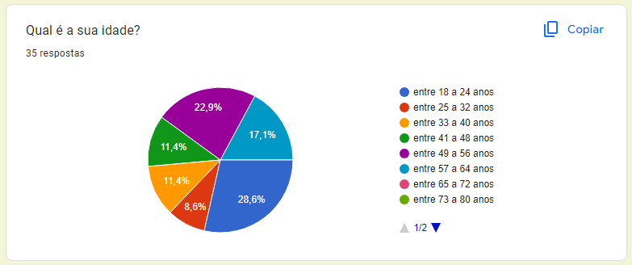
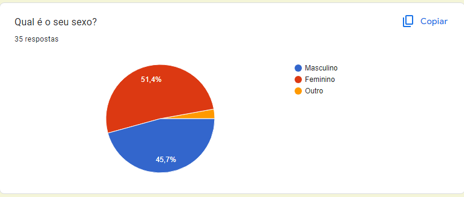
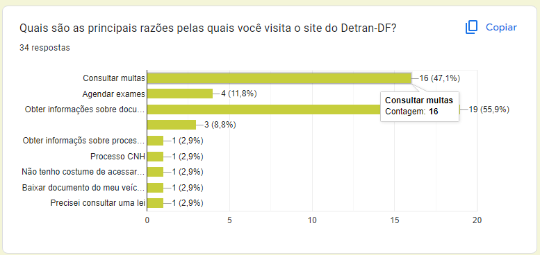
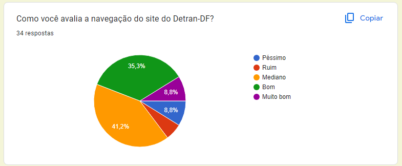
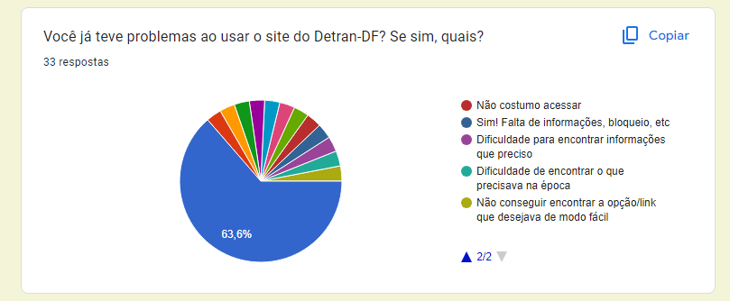
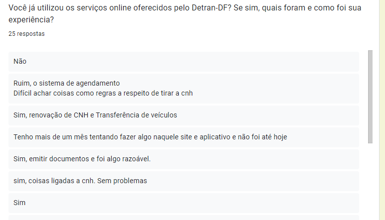

## Introdução

A compreensão do perfil de usuário é essencial para o design eficaz de interfaces e experiências digitais. Ele nos permite criar soluções sob medida que atendam às necessidades específicas de cada grupo de usuários, melhorando assim a usabilidade, a satisfação do usuário e a eficácia do site em alcançar seus objetivos. 

Este documento apresenta uma visão detalhada do perfil de usuário descoberto durante o projeto, destacando suas características distintivas, necessidades específicas e expectativas em relação à interação com o site. Além disso, oferece recomendações práticas para adaptar a interface e as funcionalidades do site para atender melhor às demandas e preferências desses usuários, promovendo assim uma experiência digital mais envolvente, intuitiva e gratificante. 

## Metodologia

Para tal, utilizamos do método de pesquisa, divulgando-a em diversos meios de comunicação da comunidade universitária e outras. A razão foi por conta da facilidade de divulgar e obter dados, rapidez e objetividade das perguntas orquestradas, facilitando bastante o andamento do projeto e para que sejam montadas as demais partes do projeto. 

## Resultados

No total, obtivemos 35 respostas, cujos tópicos estarão listados a seguir: 

### Questão 1: Qual é a sua idade?

A faixa etária informada se mostrou bastante variada, com a maior parte do público informado tendo de 18 a 24 anos e 49 a 56 anos.

### Questão 2: Qual é o seu sexo?

O público informado, de maneira geral, foi bem dividido, mas a maior parte do público que respondeu a pesquisa é feminino.

### Questão 3: Qual é a sua ocupação atual?

A maioria dos votantes é estudante, mas há uma abrangência de ocupações informadas.

### Questão 4: Qual é o seu nível de escolaridade?

Também abrangente, havendo uma predominância de estudantes na pesquisa.

### Questão 5: Com que frequência você acessa o site do Detran-DF?

A maioria dos usuários informou que raramente utilizam o site do Detran-DF.

### Questão 6: Quais são as principais razões pelas quais você visita o site do Detran-DF?

O site se mostrou mais como uma ferramenta para consulta de multas e documentos.

### Questão 7: Como você avalia a navegação do site do Detran-DF?

A maioria das respostas foram avaliando o site de forma mediana.

### Questão 8: Você já teve problemas ao utilizar o site do Detran-DF? Se sim, quais?

Boa parte dos usuários relataram nunca terem tido problemas com o site. No entanto, houveram uma série de queixas, a maioria se tratam da demora nos serviços e funcionalidades do site.

### Questão 9: Que melhorias você gostaria de ver no site do Detran-DF para torná-lo mais útil de fácil de usar?

Pergunta aberta, mas com diversas sugestões, a maioria sobre uma interface intuitiva e melhora na velocidade dos serviços.

### Questão 10:  Você já utilizou os serviços online oferecidos pelo Detran-DF? Se sim, quais foram e como foi sua experiência?

Respostas bem mistas, mas reclamações constantes em relação a interface e agilidade dos serviços.

### Questão 11: Você tem alguma sugestão ou comentário adicional sobre o site do Detran-DF que gostaria de compartilhar?

Aqui decidimos abrir espaço para a opinião do usuário sobre o que poderia melhorar no site, até para servir de sugestão/ideia ao desenrolar do projeto.

## Analise dos resultados

Após uma observação dos dados obtidos, podemos concluir que: 

- A maioria dos usuários do Portal Detran-DF são pessoas de 18 a 64 anos; 

- Não há predominância de gênero utilizador do site; 

- A maioria utiliza raramente o site, não costumam acessá-lo com frequência; 

- Utilizam para serviços simples, como consulta de multas, renovação de CNH, entre outros.

## Bibliografia

> <a id="FRM1" href="#anchor_1">1.</a> Barbosa, S. D. J., & Silva, J. A. F. C. (2010). Interação humano-computador. Elsevier Brasil. Acesso em: 10 de mai. de 2024.

## 📑 Histórico de versão

|   Versão   | Data  | Descrição            | Autor                                                  | Revisor |
| :--------: | :---: | :------------------- | ------------------------------------------------------ | ------- |
| 10/05/2024 |  1.0  | Criação da página | [Filipe Carvalho](https://github.com/filipe-002) | [Daniel Coimbra](https://github.com/filipe-002)  |