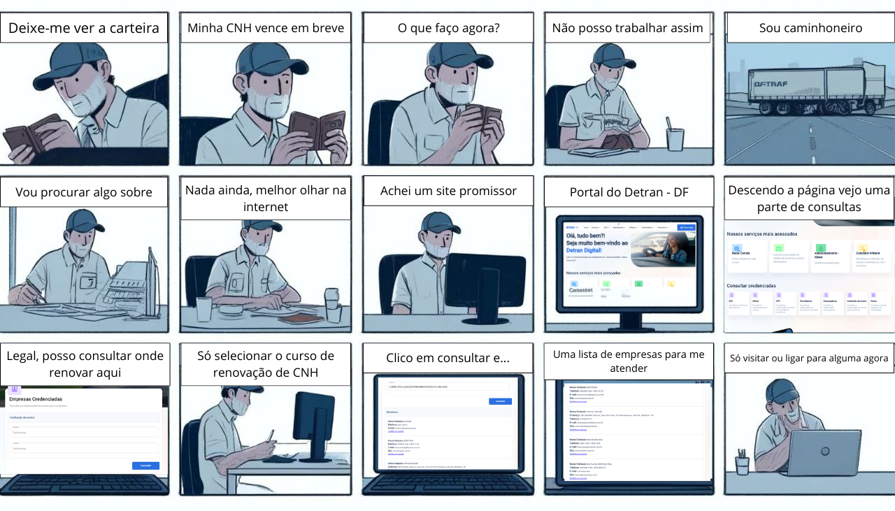

# Storyboards

## Introdução

O planejamento de uma avaliação do storyboard inclui a definição de metas, critérios, público-alvo e a criação de cronogramas apropriados para revisão e iteração. Uma avaliação minuciosa do storyboard melhorará a narrativa visual e garantirá que o projeto final atinja seus objetivos, conectando-se de maneira eficaz com o público.

## Tarefa 1: Solicitar Permissão Internacional para Dirigir

A storyboard da figura 1 busca representar uma situação real de uso do sistema do Detran DF para emitir uma Permissão Internacional para Dirigir (PID). Contexto: Caio é um jovem que mora com seu gato e vai viajar para o Canadá, precisando que alguém alimente seu gato em sua ausência; vai falar com seu amigo que o lembra de emitir sua PID para poder dirigir no exterior.

**Figura 1** - Storyboard Solicitar PID

<figcaption>Fonte: [Pedro Sena](https://github.com/pedroyen21) (2024).</figcaption>

## Tarefa 2: Emissão de nada consta

Na figura 2 abaixo, é apresentado o storyboard da tarefa de emissão de nada consta. O usuário acessa a aba de serviços, seleciona a opção de emissão de nada consta, preenche o captcha, e clica em "Emitir nada consta", após isso, a página se atualiza, e o usuário já consegue visualizar o nada consta, assim como imprimi-lo ou envia-lo por e-mail.

**Figura 2** - Storyboard Emissão de nada consta

  

Fonte: [Vinicius Vieira](https://github.com/viniciusvieira00) (2024).

## Tarefa 3: Alterar endereço do veículo

Storyboard 3 ilustra a mudança de um novo morador para uma vizinhança, quando ele se dá de cara com o vizinho, que o alerta que as correspondências do antigo dono da casa estão acumulando na caixa de correio. Isso o faz lembrar que ele próprio tem suas pendências a resolver; em especial, ele precisa atualizar a informação de endereço no cadastro de veículo do Detran-DF. Para isso, ele poderia ir até a sede, mas resolveu tentar pela internet, onde achou o Portal Detran-DF e conseguiu realizar a mudança. 

**Figura 3** - Storyboard Alterar Endereço

<figcaption>Fonte: [DanielCoimbra](https://github.com/DanielCoimbra) (2024).</figcaption>

## Tarefa 4: Emissão de CRLV

A CRLV, Certificado de Registro e Licenciamento de Veículo, é um documento obrigatório para todos os proprietários de veículos no Brasil. Ele serve como prova de que o veículo está devidamente registrado e licenciado para circular nas vias públicas.

Recentemente, foi introduzida a versão digital da CRLV (CRLV-e), que pode ser acessada por meio de aplicativos como o Carteira Digital de Trânsito (CDT) e o Portal Detran-DF. A CRLV-e tem a mesma validade legal que a versão física.

Na Figura 4, buscamos representar uma situação bastante usual para os motoristas. Mateus é um motorista de 35 anos que está no processo de venda do seu carro. Para dar prosseguimento, é necessário emitir toda a documentação para que seu veículo esteja devidamente regularizado e mostrar para o comprador que está tudo OK com o veículo, entre estes documentos está a CRLV. Para evitar filas e economizar tempo, optou por fazer o processo de emissão do documento pelo portal do Detran-DF.

**Figura 4** - Storyboard Emitir CRLV

<figure markdown> 

<figcaption>Fonte: [Filipe Carvalho](https://github.com/filipe-002) 

## Tarefa 5: Procurar empresa cadastrada para realizar renovação de CNH 

Storyboard 5 ilustra um caminhoneiro que percebe que sua CNH irá vencer em breve e precisa urgentemente encontrar uma escola que seja confiável para realizar a renovação de sua CNH  e assim voltar atrabalhar sem preocupações em ser multado no trânsito.

**Figura 5** - Storyboard de Consultar Empresas

<figcaption>Fonte: [Pedro Miguel](https://github.com/pedroMADBR) (2024).</figcaption>

## Tarefa 6: Indicar condutor como real infrator

O storyboard 6 representa uma situação onde um idoso que emprestou o carro para seu filho que acabou recebendo uma multa. O idoso e seu filho então buscam como transferir a multa para o nome do filho para que ele possa receber os pontos na carteira e pagar a mesma, eles acabam encontrando o site do Portal Detran-DF e fazendo a identificação do real infrator.

**Figura 6** - Storyboard Identificação Condutor infrator

<figcaption>Fonte: [Víctor Moreira](https://github.com/vitu-moreira) (2024).</figcaption>

## Referências Bibliográficas

> BARBOSA, S. D. J.; SILVA, B. S. **Interação Humano-Computador**. Elsevier, 2011. 

## Histórico de Versões

| Versão | Data       | Descrição                                           | Autor(es)                                              | Revisor(es)                                        |
| ------ | ---------- | --------------------------------------------------- | ------------------------------------------------------ | -------------------------------------------------- |
| `1.0`  | 15/05/2024 | Criação da página                                   | [Vinicius Vieira](https://github.com/viniciusvieira00) | [Pedro Sena](https://github.com/pedroyen21)        |
| `1.1`  | 17/05/2024 | Adição da Storyboard de solicitação de PID          | [Pedro Sena](https://github.com/pedroyen21)            | [Daniel Coimbra](https://github.com/DanielCoimbra) |
| `1.2`  | 18/05/2024 | Adição da Storyboard de emissão de CRLV             | [Filipe Carvalho](https://github.com/filipe-002)       | [Pedro Sena](https://github.com/pedroyen21)        |
| `1.3`  | 22/05/2024 | Adição da Storyboard de alterar endereço do veículo | [Daniel Coimbra](https://github.com/DanielCoimbra)     | [Pedro Sena](https://github.com/pedroyen21)        |
| `1.4`  | 22/05/2024 | Adição da Storyboard de Consultar Empresas | [Pedro Miguel](https://github.com/pedroMADBR) | [Vinicius Vieira](https://github.com/viniciusvieira00) |
| `1.5`  | 31/05/2024 | Correção de Formatação | [Pedro Miguel](https://github.com/pedroMADBR) | [Filipe Carvalho](https://github.com/filipe-002) |

