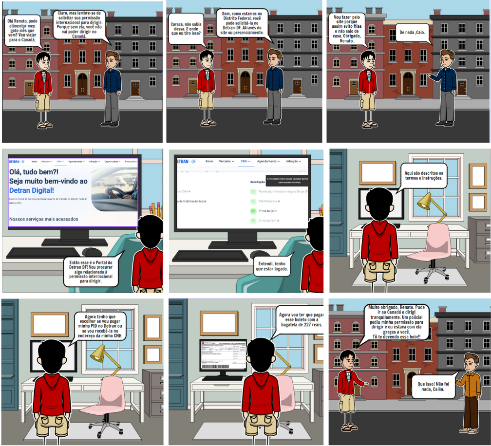

# Storyboards

## Introdução

Lorem ipsum dolor sit amet, consectetur adipiscing elit.

## Tarefa 1: Solicitar Permissão Internacional para Dirigir

A storyboard da figura 1 busca representar uma situação real de uso do sistema do Detran DF para emitir uma Permissão Internacional para Dirigir (PID). Contexto: Caio é um jovem que mora com seu gato e vai viajar para o Canadá, precisando que alguém alimente seu gato em sua ausência; vai falar com seu amigo que o lembra de emitir sua PID para poder dirigir no exterior.

**Figura 1** - Storyboard Solicitar PID

<figcaption>Fonte: [Pedro Sena](https://github.com/pedroyen21) (2024).</figcaption>

## Tarefa 2: XXXX

Lorew ipsum dolor sit amet, consectetur adipiscing elit.

**Figura 2** - Storyboard XXXX

<!-- <figure markdown> 

<figcaption>Fonte: [Geovanna Maciel](https://github.com/manuziny) (2023).</figcaption>
</figure> -->

## Tarefa 3: XXXX

Lorew ipsum dolor sit amet, consectetur adipiscing elit.

**Figura 3** - Storyboard XXXX

<!-- <figure markdown> 

<figcaption>Fonte: [Geovanna Maciel](https://github.com/manuziny) (2023).</figcaption>
</figure> -->

## Tarefa 4: XXXX

Lorew ipsum dolor sit amet, consectetur adipiscing elit.

**Figura 4** - Storyboard XXXX

<!-- <figure markdown> 

<figcaption>Fonte: [Geovanna Maciel](https://github.com/manuziny) (2023).</figcaption>
</figure> -->

## Tarefa 5: XXXX

Lorew ipsum dolor sit amet, consectetur adipiscing elit.

**Figura 5** - Storyboard XXXX

<!-- <figure markdown> 

<figcaption>Fonte: [Geovanna Maciel](https://github.com/manuziny) (2023).</figcaption>
</figure> -->

## Tarefa 6: XXXX

Lorew ipsum dolor sit amet, consectetur adipiscing elit.

**Figura 6** - Storyboard XXXX

<!-- <figure markdown> 

<figcaption>Fonte: [Geovanna Maciel](https://github.com/manuziny) (2023).</figcaption>
</figure> -->

## Bibliografia

> XXXX.Acessado em DD/MM/AAAA. Disponível em: [XXXX](https://www.XXXX.com).

## Referências Bibliográficas

> BARBOSA, S. D. J.; SILVA, B. S. **Interação Humano-Computador**. Elsevier, 2011. 

## Histórico de Versões

| Versão | Data       | Descrição         | Autor(es)                                              | Revisor(es) |
| ------ | ---------- | ----------------- | ------------------------------------------------------ | ----------- |
| `1.0`  | 15/05/2024 | Criação da página | [Vinicius Vieira](https://github.com/viniciusvieira00) | [Pedro Sena](https://github.com/pedroyen21)          |
| `1.1`  | 17/05/2024 | Adição da Storyboard de solicitação de PID| [Pedro Sena](https://github.com/pedroyen21) | --          |