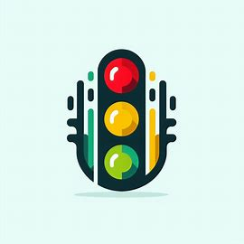

Figura 1: Logo.

Fonte: Elaboração Própria.

# Sobre o projeto
Este espaço é dedicado à documentação de todos os artefatos gerados pelo Grupo 06 na disciplina de Interação Humano-Computador (IHC) da Faculdade do Gama da Universidade de Brasília (FGA-UnB) durante o primeiro semestre de 2024. O propósito do projeto é realizar uma avaliação de IHC do Portal Detran-DF e, aplicando os princípios aprendidos em sala de aula, propor melhorias em sua interface. Este projeto tem como objetivo principal reformular e otimizar a experiência dos usuários ao interagir com os serviços digitais oferecidos pelo Detran-DF, garantindo que a interface seja intuitiva, acessível e eficiente.

# Contexto
O Portal do Detran-DF é uma ferramenta essencial para a população do Distrito Federal, oferecendo acesso a uma vasta gama de serviços relacionados ao trânsito, veículos e habilitação. No entanto, a crescente demanda por serviços digitais e as rápidas mudanças nas tecnologias de informação apontam para a necessidade de uma revisão constante das interfaces de usuário para assegurar que elas atendam às expectativas e necessidades dos usuários.

O website em questão apresenta uma série de desafios que comprometem a experiência do usuário, destacando-se a navegação confusa, que torna difícil encontrar informações específicas, levando a uma jornada frustrante pelo site. Ademais, certas seções sofrem de uma falta de clareza, onde o propósito ou as instruções não são imediatamente aparentes, confundindo os visitantes e potencialmente afastando-os. Problemas técnicos, como links quebrados, imagens que não carregam e tempos de carregamento lentos, exacerbam essas questões, diminuindo a confiabilidade e a eficiência percebida do site. Juntos, esses problemas criam uma experiência online aquém do ideal, necessitando de uma revisão cuidadosa e melhorias significativas para atender às expectativas dos usuários modernos.

## Equipe

<table>
  <tr>
    <td align="center"><a href="https://github.com/viniciusvieira00"> <b>Vinicius Angelo de Brito Vieira</b></a> 
    <td align="center"><a href="https://github.com/DanielCoimbra"> <b>Daniel Coimbra</b></a> </td>
    <td align="center"><a href="https://github.com/Filipe-002"> <b>Filipe Carvalho da Silva </b></a> </td>
    <td align="center"><a href="https://github.com/pedroyen21"> <b>Pedro Sena Barbosa Holtz Yen</b></a> 
    <td align="center"><a href="https://github.com/vitu-moreira"> <b>Víctor Moreira Almeida</b></a> 
  </tr>
</table>

## Histórico de versão

| Versão| Data | Descrição  | Autor(es)  | Revisor(es) |
| ------- | ------ | ------- | -------- | -------- |
| `1.0` | 25/03/2024 | Criação do GitPages | [Vinicius Vieira](https://github.com/viniciusvieira00) | . |
| `1.1` | 01/04/2024 | Atualização dos membros do grupo | [Vinicius Vieira](https://github.com/viniciusvieira00) | . |
| `1.2` | 08/04/2024 | Atualização da página inicial | [Filipe Carvalho](https://github.com/filipe-002) | . |
